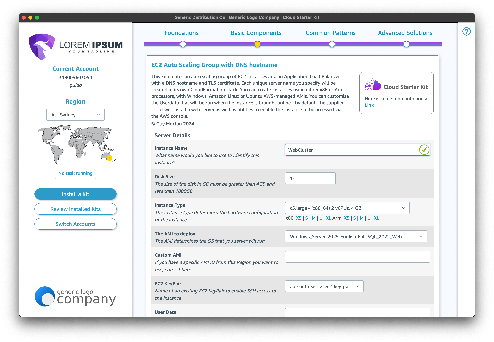
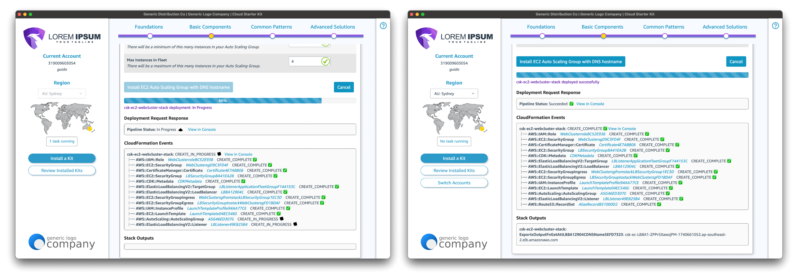
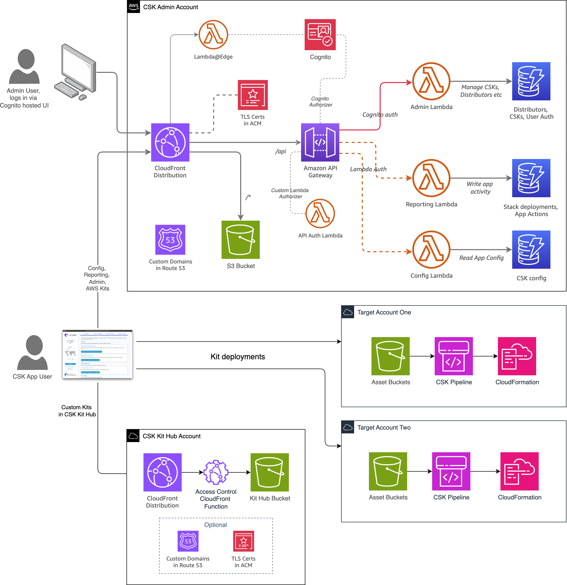

# Infrastructure Deployment Framework

This project enables you to build a distributable, cross-platform desktop app that makes it easy for lower-skilled users to successfully deploy infrastructure into their AWS accounts. It provides a common user experience for deploying [CDK](https://docs.aws.amazon.com/cdk/v2/guide/home.html), [SAM](https://docs.aws.amazon.com/serverless-application-model/latest/developerguide/what-is-sam.html) and [CloudFormation](https://aws.amazon.com/cloudformation/)-based solutions ("Kits") and reduces the complexity of deploying them - no trips to the command line, no installing of Python or Node required.

Here's what configuring a CDK, SAM or CloudFormation-based Kit looks like in the app:

The desktop app is implemented using the popular [Electron](https://electronjs.org) framework that also powers apps such as Chime, Discord, Slack and Visual Studio Code.

## Making IaC easier to adopt

Examples of wrapping user-friendly features around them to make using them easier:

- Common configuration panel for all Kits
- Pre-populating parameters with information from the user's account (eg VPCs)
- Helpers in the UI to assist in making valid choices, eg matching Arm instance types with Arm AMIs
- Simplified display of what is being deployed and deployment state

The framework doesn't simplify by removing choices or by compromising security. A key goal is to make it easier for you to help your users build well-architected workloads.

### Configuration standardisation

The app presents a simple one-form UI to users for all types of kits, but CDK, SAM and CloudFormation all manage passing configuration into your project in different ways. The Infrastructure Deployment Framework provides you with mechanisms that make them all present the same way to the user.

- For CloudFormation projects, the app will read and present Parameters defined in your templates without modification.
- For CDK projects, the app introduces a standardised parameters file that is read by the app and consumed by the CDK app during synthesis.
- For SAM projects, the app uses the same parameters file approach, but packages and formats it how CloudFormation requires it to be provided.

### Enhanced parameter behaviours and "smart" parameter types

The Infrastructure Deployment Framework adds logic to make a number of standard CloudFormation parameter types easier to configure in the UI. It achieves this by querying the target account for key information that can be used to guide the user, including finding VPCs and Subnets, available instance types and AMIs.

In addition, it defines a number of custom "smart" parameter types. These include:

- `CSK::PrefixList` - when coupled with a `Service` parameter, will return the AWS-managed prefix list ID for that service in the chosen Region.
- `CSK::InstanceType` - a drop-down of all the available instance types is shown
- `CSK::UserIp`, we fetch the user's external IP address and set the value of that parameter to match it.
- `CSK::DbEngineVersion` - will render as a drop-down of RDS engine versions that are available in the Region
- `CSK::DbInstanceClass` - will render as a drop-down of RDS instance classes that are available in the Region for the chosen DB Engine
- `CSK::Userdata` - renders as a textarea and will pull in sample userdata scripts that you will find under `scripts/userdata`
- `CSK::VpcEndpoint` - creates the parameter as a hidden field containing any VPC endpoints that exist in the chosen Region, keyed by VPC ID

## Kit installation (and, optionally, updating)

The framework provides a simplified, compact and more accessible view of the CloudFormation actions taken to deploy a Kit.

Kits can optionally be marked as able to be updated via the app. This means your user can reconfigure parameters and update an existing deployed stack rather than having to make changes manually.

### What's included?

In addition to the Electron app, the framework includes a "Kit Hub", which allows you to easily create a repository of Kits that your users can browse, configure and deploy through the app. The Admin Portal that allows you to create, configure and manage access to the Kits that you make available in your app, as well as collect usage metrics.

## Next steps

To learn more about how this framework works, go through the [workshop](cloud-starter-kit-workshop/index.en.md) for the Cloud Starter Kit sample app. It goes through all the steps required to build and configure each of the components of this framework.

## Security

See [CONTRIBUTING](CONTRIBUTING.md#security-issue-notifications) for more information.

## License

This library is licensed under the MIT-0 License. See the LICENSE file.
