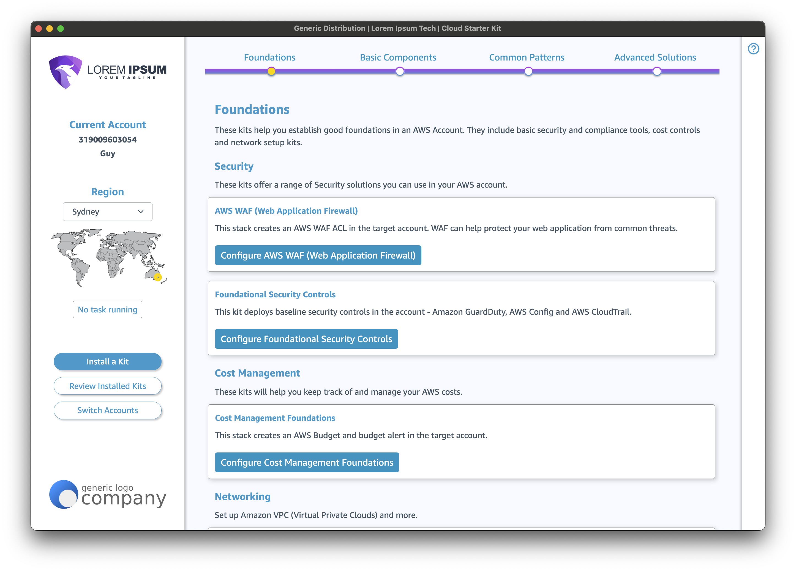
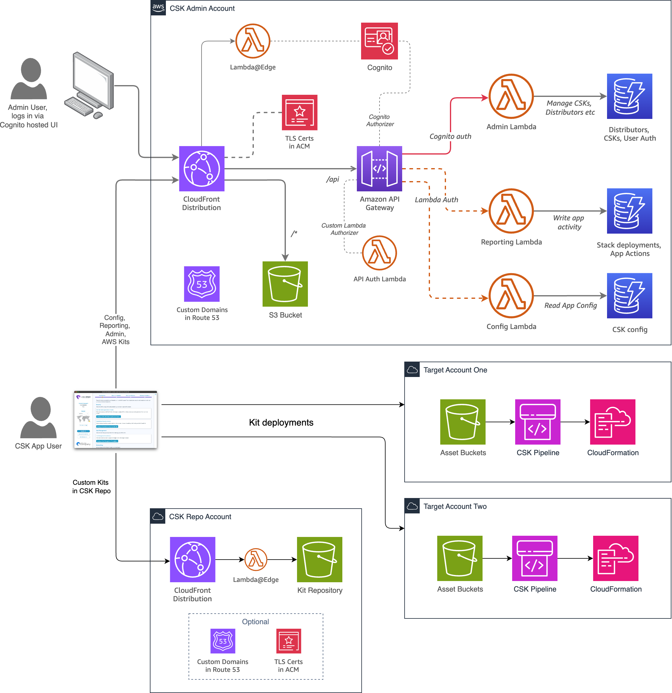

# Cloud Starter Kit Admin Portal

This project, built using CDK with Python, is the admin companion to the Cloud Starter Kit (CSK) App, a desktop app 
built using the Electron framework, that facilitates the deployment of solutions
on AWS. It looks like this:



The CSK App calls APIs provided by this admin portal to fetch configuration it requires. It also hosts Starter Kits for the CSK App - more information about how these are defined can be found in the [KIT_CONFIGURATION](KIT_CONFIGURATION.md),  [CFN_PROJECT_PREP](CFN_PROJECT_PREP.md) and [CDK_APP_PREP](CDK_APP_PREP.md) readme files.

Admin users log into the Admin Portal via Cognito. CSK App users are not required to log into the admin portal and do not require Cognito logins.

## Architecture

The admin portal deploys the following AWS services:

* Amazon Cognito (user pool for admin users)
* Amazon CloudFront (CDN and request auth/routing)
* Amazon API Gateway (API management and authorization)
* Amazon Route 53 (DNS records)
* Amazon DynamoDB (NoSQL database tables to store data)
* Amazon S3 (Object storage for web-accessible content)
* AWS Certificate Manager (TLS certs to use with API gateway and CloudFront)
* AWS Lambda (Serverless functions)

It deploys static content into the S3 bucket that provides the admin interface. The admin interface is written in HTML/CSS and vanilla JavaScript.



## Pre-installation steps

Install the dependencies for the Lambda@Edge functions.

``` bash
$ cd custom-resources
$ pip install crhelper -t .
```

and 

``` bash
$ cd lambda/cognito_auth
$ npm install
```

>NOTE: If you make any changes to the Lambda@Edge functions you must force a new version to be created by modifying the resource ID for the Lambda version in the web stack. If you do not, your changes will not be propagated.

You need also to create a Lambda layer that contains the libraries specified in the `requirements.txt` file under the `lambda` directory. 

>NOTE: You must build this layer using Python 3.12. If you are running a different version, please upgrade to 3.12 before building this layer.

To do this, run the relevant `make_layer` script in that directory (either `make_layer.sh` for Mac/Linux or `make_layer.ps1` for Windows):

``` bash
$ cd lambda
$ chmod +x make_layer.sh
$ ./make_layer.sh
```

or, while running Powershell as an Administrator:

``` powershell
% cd lambda
% Set-ExecutionPolicy RemoteSigned
% .\make_layer.ps1
```

Once the script has completed, you should have a file called `python.zip` in the `lambda` directory. If for any reason the script fails, use [the documentation here](https://docs.aws.amazon.com/lambda/latest/dg/python-layers.html) to build the layer and place it in the correct directory.   

The layer's directory structure should look like this:

```
/
├─ lib/
│  ├─ python3.12/ 
│    ├─ site-packages/
│      ├─ shortuuid/
```

## Prerequisites

Before you install this project you will need to register a domain name, or create 
a subdomain of an existing domain, and delegate it to Route 53 in the target AWS 
account. You will need the resulting Hosted Zone ID to configure the project before
you run it.

## The `parameters.json` file

There is a file `parameters-template.json` in the root of the project. Copy that and
rename the copy `parameters.json`. Enter into it the host name and hosted zone ID you 
created in the prerequisite step.

```json
{
    "hosted_zone": "<your domain name>",
    "hosted_zone_id": "<your hosted zone id>",
    "environment": "<eg prod or dev>",
    "user_pool_id": "<your cognito user pool id>",
    "user_pool_client_id": "<your cognito user pool client id>"
}
```

>The Cognito settings will be exported from the Cognito stack in a future step. We have to set these here because we need them to create a Lambda@Edge function which cannot use ENV variables, and there is no better way to pass configuration that resolves
during synth

## Deploying

Once you have entered the hosted zone info into the parameters file you can deploy the CognitoStack:

```
cdk deploy csk-admin-cognito-stack
```

Once deployed, you will need to grab the exported values from the
stack outputs `csk-admin-user-pool-client-id` and `csk-admin-user-pool-id` and enter them into the `parameters.json` file.

Once you have done that, you can deploy the other two stacks. You can do this by just requesting the deployment of the WebStack, as it will automatically deploy the ApiStack first.

>Note that the web and Cognito stacks must be deployed to `us-east-1`, but the api stack can be deployed into any Region.

```
cdk deploy csk-admin-web-stack
```

## Before you log in

### Create a Cognito user

Once the stacks are deployed you will need to manually create 
your first Cognito user via the Cognito console. Once created, copy the user_id (it's a UUID) and keep it handy for the next step.

### Update DynamoDB

The DynamoDB tables are seeded with some sample data to get you started. Edit the record in the table that includes the string `userdistributors` (all the table names have been exported from the api stack, for your convenience) and replace the user_id with your user_id.

### Log in

Navigate to your admin hostname and you should be prompted to log in. Once in, you should see the generic distributor and be able to create and edit CSKs.

## Troubleshooting

If the Cognito hosted UI customisations aren't applied, edit the Cognito stack to alter the resource ID of the CustomResource and re-deploy.

---

### Generic CDK instructions

The `cdk.json` file tells the CDK Toolkit how to execute your app.

This project is set up like a standard Python project.  The initialization
process also creates a virtualenv within this project, stored under the `.venv`
directory.  To create the virtualenv it assumes that there is a `python3`
(or `python` for Windows) executable in your path with access to the `venv`
package. If for any reason the automatic creation of the virtualenv fails,
you can create the virtualenv manually.

To manually create a virtualenv on MacOS and Linux:

```
$ python3 -m venv .venv
```

After the init process completes and the virtualenv is created, you can use the following
step to activate your virtualenv.

```
$ source .venv/bin/activate
```

If you are a Windows platform, you would activate the virtualenv like this:

```
% .venv\Scripts\activate.bat
```

Once the virtualenv is activated, you can install the required dependencies.

```
$ pip install -r requirements.txt
```

At this point you can now synthesize the CloudFormation template for this code.

```
$ cdk synth
```

To add additional dependencies, for example other CDK libraries, just add
them to your `setup.py` file and rerun the `pip install -r requirements.txt`
command.

## Useful commands

 * `cdk ls`          list all stacks in the app
 * `cdk synth`       emits the synthesized CloudFormation template
 * `cdk deploy`      deploy this stack to your default AWS account/region
 * `cdk diff`        compare deployed stack with current state
 * `cdk docs`        open CDK documentation

Enjoy!
