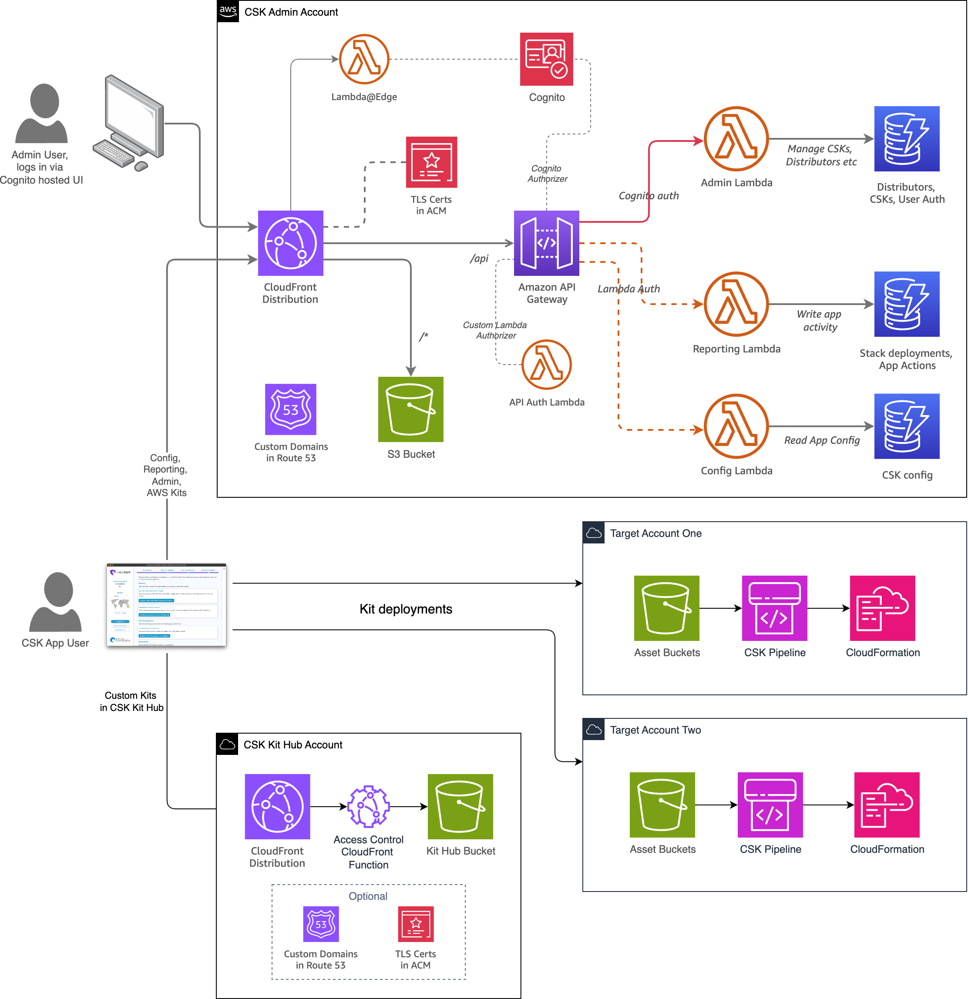

The three projects in this workshop will build the following architecture in AWS, as well as the standalone desktop app. 

Serverless services are used exclusively, and all AWS Cloud infrastructure is built using the [CDK with Python](https://docs.aws.amazon.com/cdk/v2/guide/work-with-cdk-python.html).

Click Next to start building!