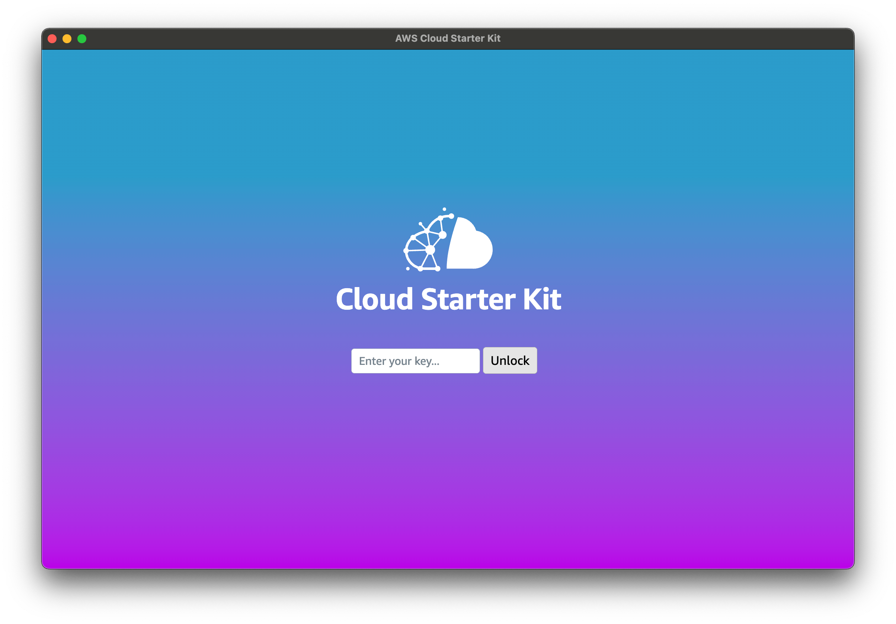
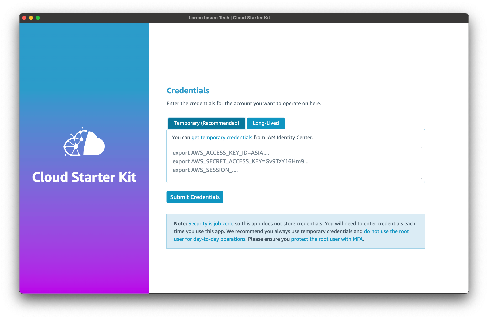

Now you have built the app, you can not only run it in developer mode but also build an installer that you can distribute for testing. 

>NOTE: you will need to [sign your app](https://www.electronjs.org/docs/latest/tutorial/code-signing), or get it signed, to avoid unsigned app warnings on Mac and Windows machines. 

For now we will assume you are either running the app in developer mode, or an installed version on either a Windows or Mac computer.

## Running an unsigned App

#### On Windows
Depending on how you are using Windows, may be prompted about running unsigned software. If you cannot bypass this you may need to right-click the App and choose "Run as administrator". 

#### On a Mac
After you have installed the App in your Applications folder, open Terminal and execute the following command:
```bash
sudo xattr -cr /Applications/Cloud\ Starter\ Kit.app
```


## The CSK App Key

When you first launch the app you should see this screen:



This will appear on first load when the app is launched on any new device.

The CSK App Key is a randomly-generated [shortuuid](https://pypi.org/project/shortuuid/) that uniquely identifies a set of app configuration. The configuration data is stored and managed in the CSK Admin portal. 

Your workshop leader can provide you with a key on the day, or you can install the admin portal first and generate your own key.

>NOTE: The CSK App is preconfigured to use the AWS-managed Admin portal. If you wish to use your own admin portal, you will need to reconfigure and rebuild the CSK app to point to your admin host. You will also need to have your final builds signed for the OSes you plan to support with your CSK app.
>
>You can be given access to the AWS-managed CSK Admin portal allowing you to manage your own customers, create keys and configurations. You can use your own CSK Kit Hub with the AWS-managed admin portal.

Keys are unique to each end customer who uses the app to deploy workloads into AWS.

Once provided with a key, the app will attempt to call `/get/config` on the Admin portal host. Assuming the key is found in the portal, the configuration data that will be returned will look something like this:

```json
{
    "BusinessName": "Lorem Ipsum Tech",
    "CountryCode": "AUS",
    "DefaultRegion": "ap-southeast-2",
    "LogoUrl": "https://cloud-starter-kit.com/images/no-csk-logo.png",
    "LogoCssLeft": "height: fit-content",
    "LogoCssRight": "height: fit-content; padding: 0px;",
    "FileHost": "",
    "PreferredLanguage": "en-US",
    "csk_id": "e3YeCgHwiZKtFksj3qLhFRa",
    "distributor": {
        "BusinessName": "AWS Distribution Inc",
        "LogoUrl": "https://aws-distie.com/distie-logo.svg",
        "LogoCss": "height: fit-content",
        "FileHost": ""
    }
}

```

The parameters have the following purposes/effect in the app:

| Parameter | What it defines |
| -------- | ------- |
| BusinessName | The name of the business that is using the app |
| CountryCode | Three-letter country code where the business operates |
| DefaultRegion | The AWS Region the app should default to on first run |
| LogoUrl | A publicly-accessible URL for the business's logo |
| LogoCssLeft | CSS to adjust the logo's position and styling when it appears at the top of the left-hand menu |
| LogoCssRight | CSS to adjust the logo's position and styling when it appears on the Credentials page |
| FileHost | If provided, a CSK Kit Hub that will be used instead of the default one at cloud-starter-kit.com, or specified in distributor.FileHost |
| PreferredLanguage | The default language to launch the app in |
| csk_id | This is the CSK key, reflected back to the client |
| distributor | This is the details about the entity that issued this CSK key. It could be an AWS distribution partner, an AWS team, a specialist AWS partner or an ISV...anyone with a solution they want to help people deploy. |
| distributor.BusinessName | The name of the issuing entity that created and owns the app key |
| distributor.LogoUrl | A publicly-accessible URL for the issuing entity's logo |
| distributor.LogoCss | CSS to adjust the logo's position and styling when it appears at the bottom of the left-hand menu |
| distributor.FileHost | If provided, a CSK Kit Hub that will be used instead of the default one at cloud-starter-kit.com |


## Credentials and Permissions

What the app is permitted to do is determined by the policies associated with the credentials it is given. The app itself does not store any credentials between sessions.

>Important! It is always recommended that you grant the [least privileges](https://docs.aws.amazon.com/IAM/latest/UserGuide/best-practices.html#grant-least-privilege) required to perform the tasks you want the app to do.

Once the CSK App opens you can paste temporary credentials for the account you want to use into the credentials box. The format for these credentials is the standard `Command line or programmatic access` output for setting AWS environment variables, as provided by [AWS Identity Center](https://aws.amazon.com/iam/identity-center/). 

Using [temporary credentials is best practice](https://docs.aws.amazon.com/IAM/latest/UserGuide/best-practices.html#bp-users-federation-idp), but the sample app also supports [IAM user access keys](https://docs.aws.amazon.com/IAM/latest/UserGuide/id_credentials_access-keys.html) if you need to use them. 




Once the credentials are pasted in, click `Submit Credentials`. 

If the provided credentials are valid, the view will change to show the main UI. The `regions` dropdown will be populated with the regions available to this account, and the account number will be displayed. 

You can switch to a different account using the `Switch Accounts` button.

## Installing Kits 

The default kits can be deployed into the account for which you have loaded credentials. To start with, try deploying the `VPC with NAT` kit. This kit is written in CDK and will deploy a standard VPC with the number of NAT gateways you specify. You should see a details panel open that shows the progress of the deployment.

### Troubleshooting

If the CDK app fails, check the CodeBuild stage in the pipeline. If the account you are using has previously been bootstrapped for the CDK but the CDKToolkit stack has since been deleted, your CDK environment will need to be repaired.

Click Next to learn about the CSK Admin Portal.