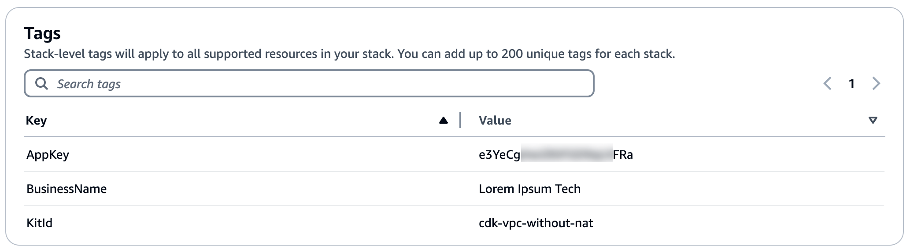

You can delete the stacks used to deploy the CSK components via the CloudFormation console.

Select the stack you wish to delete and clicking **Delete**. 

In the confirmation dialogue that pops up, click **Delete stack**.

#### The CSK Admin stacks

* csk-admin-web-prod-stack ([us-east-1](https://us-east-1.console.aws.amazon.com/cloudformation/home?region=us-east-1))
* csk-admin-cognito-prod-stack ([us-east-1](https://us-east-1.console.aws.amazon.com/cloudformation/home?region=us-east-1))
* csk-admin-cognito-ui-prod-stack ([us-east-1](https://us-east-1.console.aws.amazon.com/cloudformation/home?region=us-east-1))
* csk-admin-api-prod-stack ([the Region you chose](https://console.aws.amazon.com/cloudformation/home))

#### The CSK Kit Hub stack

* csk-kit-repo-prod-stack ([us-east-1](https://us-east-1.console.aws.amazon.com/cloudformation/home?region=us-east-1))

#### The CSK Pipeline stack

* csk-cdk-app-delivery-pipeline-stack ([in each Region to which you deployed a Kit](https://console.aws.amazon.com/cloudformation/home))

#### Kits you deployed

The Stacks deployed by the CSK are all prefaced with `csk-` and have tags similar to the following:

## Retained Resources and ongoing charges

If you delete the stacks created in this workshop, the following resources will be retained:

* S3 buckets prefaced with `csk-` - you can find, empty and delete these manually via the console.
* The CDKToolkit stack - it is not advisable to delete the CDK unless you are completely sure you will not use it again in future. It has no ongoing running cost.
