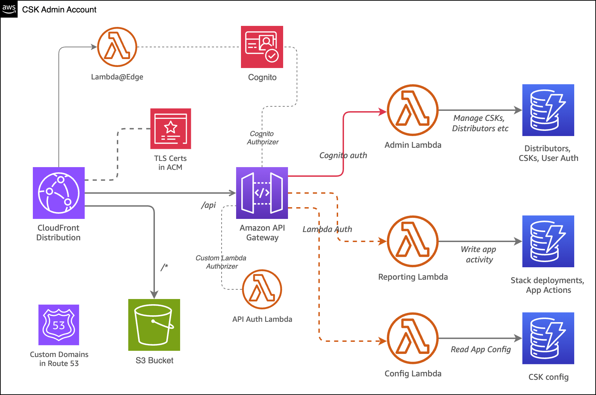

# The CSK Admin portal
 

This project, built using CDK with Python, is the admin companion to the Cloud Starter Kit (CSK) App and deploys the architecture below.

The CSK App calls APIs provided by this admin portal to fetch configuration it requires.

Admin users log into the Admin Portal via Cognito. 

CSK App users are not required to log into the Admin Portal and do not require Cognito logins.

## Architecture

The admin portal deploys the following AWS services:

* [Amazon CloudFront](https://aws.amazon.com/cloudfront) (CDN and request auth/routing)
* [Amazon S3](https://aws.amazon.com/s3) (Object storage for web-accessible content)
* [AWS Lambda@Edge](https://aws.amazon.com/lambda/edge/) (Used by CloudFront to enable directory index files)
* [Amazon Route 53](https://aws.amazon.com/route53/) (DNS records)
* [AWS Certificate Manager](https://aws.amazon.com/acm) (TLS certs to use with API gateway and CloudFront)

And 

* [Amazon Cognito](https://aws.amazon.com/cognito) (user pool for admin users)
* [Amazon API Gateway](https://aws.amazon.com/apigateway) (API management and authorization)
* [Amazon DynamoDB](https://aws.amazon.com/dynamodb) (NoSQL database tables to store data)
* [AWS Lambda](https://aws.amazon.com/lambda) (Serverless functions)

It deploys static content into the S3 bucket that provides the admin interface. The admin interface is written in HTML/CSS and vanilla JavaScript.

Click <a href="deploying.en.md">next</a> to deploy the CSK Admin Portal.