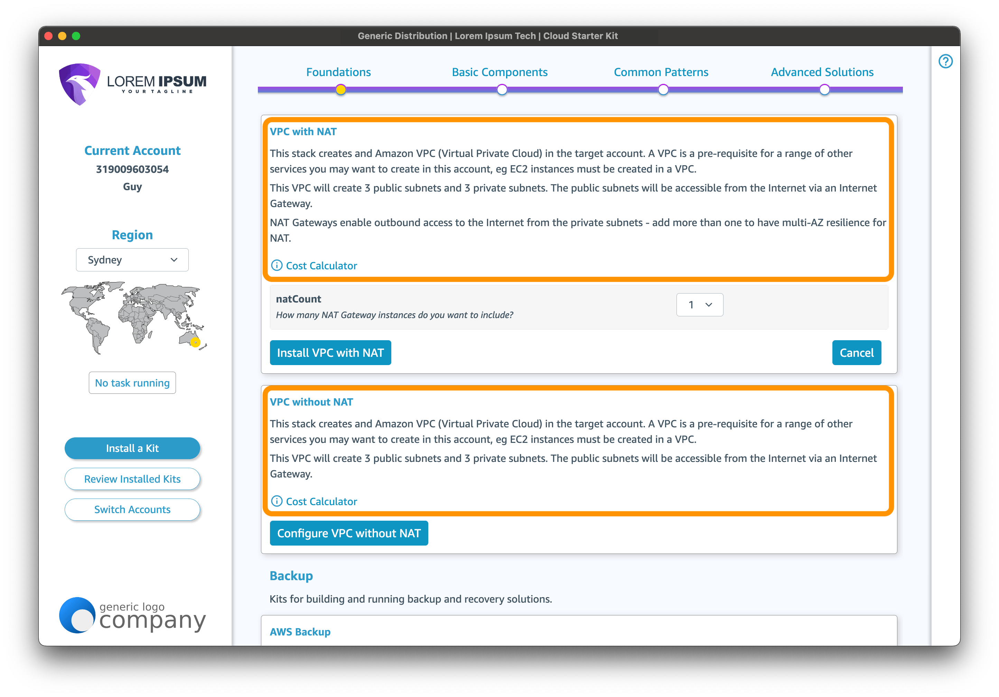

# How the Kit Hub works
 


The content in the CSK Kit Hub drives most of the UI and functionality of the CSK app. It does this by providing a configuration framework, directory layout and standardised Kit format that the CSK understands. This page walks you through the sample content. 

Further down this page you will find instructions on how to update it with your own Kits and content.

## The `www` directory

All the content you need to understand and modify is under the `www` directory.

#### about

You can put content here that gives users additional information about your Kits. 

This URL will appear in a popup window if the user chooses `About the Cloud Starter Kit` from the app's context menu (right-click in the app).

#### help

You can put content here that will help people use your Kits. 

This URL will appear in a popup window if the user chooses `Cloud Starter Kit Help` from the CSK App's Help menu.

#### kits

The Kits directory under `www` holds your Kits. At the root of this directory you must have:

```
www/
├─ kits/
│  ├─ index.html
│  ├─ top-level-categories.json
│  ├─ category-descriptions.json
│  ├─ cdk-apps/
│  ├─ cfn-templates/ 
```

#### index.html

This is a simple HTML file that will be served to anyone requesting the `/kits/` route of your Kit Hub site. Nothing in the app points to this file so you can choose whether or not you want to customise it. It may be useful from an SEO point of view if you publicise the `/kits/` route anywhere.

#### top-level-categories.json

This is where you define the categories that will be displayed in the main content area of the app. 


The `top-level-categories.json` contains a JSON array of top-level category objects:


```json
[ 
    {
        "Label": "Common Patterns",
        "Description": "These kits solve for common patterns using multiple AWS services.",
        "CategoryOrder": [
            "Migration",
            "Backup",
            "Identity",
            "Messaging and Events"
        ]
    },
    {...}
]
```

The parameters in each top-level category are:

| Parameter | What it defines |
| -------- | ------- |
| Label | The text that will be displayed in the heading area |
| Description | The text that will appear under the heading at the top of each top-level category page |
| CategoryOrder | An array of sub-categories. Sets the order in which Kits within those categories will appear for this top-level category |


#### category-descriptions.json

The `category-descriptions.json` file contains a JSON object with key/value pairs where the keys are the category label and the values are the descriptive text that will appear under the category heading.


```json
{
    "Networking": "Set up Amazon VPC (Virtual Private Clouds) and more.",
    "Virtual Machines": "Create EC2 instances with a range of hardware configurations and operating systems.",
    "Databases": "Create database solutions with popular databases such as MySQL, PostgreSQL, and MSSQL using Amazon RDS (Relational Database Service).",
}
```

#### The `cdk-apps` directory

CDK app-based Kits are stored in the cdk-apps directory. The structure for this directory is:

```
cdk-apps/
├─ catalogue.json
├─ app1/
│  ├─ buildspec.yaml
│  ├─ app.py
│  ├─ etc...
├─ app1.json
├─ app2/
│  ├─ buildspec.yaml
│  ├─ package.json
│  ├─ bin/app.ts
│  ├─ lib/etc...
├─ app2.json
```

#### catalogue.json

At the root of the `cdk-apps` directory there is the `catalogue.json` file. This contains a JSON object with a key `Catalogue` that contains an array of CDK app collections grouped by a top-level category and sub category. Each CDK app collection contains an array of Kit objects that define metadata about each Kit in the collection.



```json
{
  "Catalogue": [
    {
      "TopLevelCategory": "Foundations",
      "Category": "Networking",
      "Kits": [
        {
          "Name": "VPC with NAT",
          "Manifest": "vpc-with-nat.json",
          "Description": "This stack crea...e for NAT. ",
          "CostCalculator": "https://calculator.aws/#/estimate?id=4169b"
        },
        {
          "Name": "VPC without NAT",
          "Manifest": "vpc-without-nat.json",
          "Description": "This stack creat...rnet Gateway.",
          "CostCalculator": "https://calculator.aws/#/estimate?id=3fd3a36e"
        }
      ]
    },
    {
      "TopLevelCategory": "Basic Components",
      "Category": "Virtual Machines",
      "Kits": [
        {
          "Name": "Single EC2 instance",
          "Description": "A kit to cre... stack.",
          "Manifest": "ec2.json",
          "AllowUpdates": "false"
        }
      ]
    },
    {
      "TopLevelCategory": "Common Patterns",
      "Category": "Messaging and Events",
      "Kits": [
        {
          "Name": "Simple Queue",
          "Description": "If you need to ...ions, the kits you need are here.",
          "Manifest": "queue.json"
        }
      ]
    }
  ]
}
```

The parameters in the catalogue are:

| Parameter | What it defines |
| -------- | ------- | 
| Catalogue | Top level object key whose value is the array of CDK app collections | 
| TopLevelCategory | Which top-level category will this collection appear under | 
| Category | The sub category this collection of CDK app Kits will appear under | 
| Kits | The array of CDK app Kits that are in this collection | 
| Name | The name of this Kit as it will appear in the UI |
| Description | The description of this Kit as it will appear in the UI |
| Manifest | The individual Kit's JSON manifest file name. Must be the same as the app's directory name, appended with `.json` |
| VpcRequired | If a VPC is required for this Kit, set this to true |
| AmiFilter | Can filter the AMI list by OS by being set to Ubuntu, AmazonLinux or Windows |
| AllowUpdates | Whether to allow updates to this Kit |


#### Individual Kit JSON manifests

This individual Kit manifest JSON files are where input parameters and other metadata about the Kit are defined. 


It consists of a JSON file with the following structure:

```json
{
    "ConfigFile": "parameters.json",
    "ParameterGroups": [
        {
            "Label": {
                "default": "Server Details"
            },
            "Parameters": [
                "ec2Name",
                "os"
            ]
        },
        {
            "Label": {
                "default": "Networking Details"
            },
            "Parameters": [
                "vpcId",
                "subnetId"
            ]
        }
    ],
    "Parameters": {
        "ec2Name": {
            "Label": "Instance Name",
            "Description": "What name would you like to use to identify this instance?",
            "Type": "String",
            "Default": "MyWebServer",
            "AllowedPattern": "\\w{1,30}"
        },
        "os": {
            "Label": "Operating System",
            "Description": "The OS that your server will run",
            "AllowedValues": [
                "Windows",
                "Linux"
            ],
            "Default": "Linux"
        },
        "vpcId": {
            "Label": "VPC",
            "Description": "The VPC where the instance is going to be deployed",
            "Type": "AWS::EC2::VPC::Id"
        },
        "subnetId": {
            "Label": "Subnet",
            "Description": "The Subnet where this instance is going to be deployed",
            "Type": "AWS::EC2::Subnet::Id"
        }
    },
    "Tags": {},
    "Stacks": [
        {
            "name": "csk-ec2-stack",
            "resourceCount": 15,
            "hasOutputs": false
        }
    ],
    "FileList": [
        "ec2/bin/ec2.js",
        "ec2/lib/ec2.js",
        "ec2/buildspec.yml",
        "ec2/cdk.json",
        "ec2/package.json",
        "ec2/parameters-template.json"
    ]
}
```

| Parameter | What it defines |
| -------- | ------- | 
| ConfigFile | The config file that will be used to pass parameters set in the app into the CDK app | 
| ParameterGroups | Array of objects containing a Label and Parameters key, used to group parameters in the UI | 
| Parameters | A JSON object where the keys are parameters that will be passed into the CDK app at deploy time. Parameters use the same syntax as CloudFormation parameters. |
| Tags | Key-Value pairs that should be created as Tags on the stack |
| Stacks | Array of stack objects that describe the stacks that will be created by this Kit |
| name | The stack name that the CSK app should track when this Kit is being deployed |
| resourceCount | The number of resources this stack is expected to deploy |
| hasOutputs | Whether this stack will produce CloudFormation outputs |
| FileList | The files needed to enable this kit to be deployed. |

#### The `cfn-templates` directory

The `cfn-templates` directory has the following structure:

```
cfn-templates/
├─ catalogue.json
├─ kit_template1.json
├─ kit_template2.json
```

As with the `cdk-apps` directory, the Catalogue file add some metadata around the projects that appears in the UI in the same places it appears with the CDK Catalogue.

```json
{
    "Catalogue": [
        {
            "TopLevelCategory": "Foundations",
            "Category": "Security",
            "Kits": [
                {
                    "Name": "Foundational Security Controls",
                    "Description": "This kit deploys baseline security controls.",
                    "Templates": [
                        "management-governance.json"
                    ],
                    "VpcRequired": false
                }
            ]
        },
        {
            "TopLevelCategory": "Foundations",
            "Category": "Cost Management",
            "Kits": [
                {
                    "Name": "Cost Management Foundations",
                    "Description": "This stack creates an AWS Budget and budget alert .",
                    "Templates": [
                        "cost-management.json"
                    ],
                    "VpcRequired": false
                }
            ]
        }
    ]
}
```

Parameters are exactly the same as for the CDK Kits, with the exception of the Templates parameter.

| Parameter | What it defines |
| -------- | ------- | 
| Catalogue | Top level object key whose value is the array of CDK app collections | 
| TopLevelCategory | Which top-level category will this collection appear under | 
| Category | The sub category this collection of CDK app Kits will appear under | 
| Kits | The array of CDK app Kits that are in this collection | 
| Name | The name of this Kit as it will appear in the UI |
| Description | The description of this Kit as it will appear in the UI |
| Templates | An array of templates that will be deployed as part of this Kit |
| VpcRequired | If a VPC is required for this Kit, set this to true |
| AmiFilter | Can filter the AMI list by OS by being set to Ubuntu, AmazonLinux or Windows |
| AllowUpdates | Whether to allow updates to this Kit or not |

## Enabling Access Control

You can create a passcode that users must include in http requests to allow them to access your Starter Kits.

#### Create a Kit Hub passcode

In the AWS console, navigate to CloudFront. Choose `Functions` on the left hand menu, and then click on the CSK kit hub function (will have `csk-kit-hub` in the name). In the console that appears, see the `Associated KeyValueStore` section. Click on the link to the live key value store. 

In the KeyValueStore details page, click the `Edit` button next to the Key-Value pairs section. Click on the editor where it currently says `none`, set it to the passcode you wish to use and click the tick icon to confirm. Click `Save Changes`.

#### Configure a CSK

In the admin portal, create or edit a CSK and enter your passcode in the `Kit Hub Passcode` field. Save your changes.

Now, a CSK app that uses the key associated with this CSK will receive the passcode and use it to access the protected Kit Hub.

## Kit Utils

For CloudFormation template-based projects, look in the `kit-utils/cfn` directory in this project repo to find helper scripts and examples. Note that CFN templates must be in JSON format and there is a script in that directory to allow you to flip them from YAML. Do not try to use a generic converter as CloudFormation YAML has some features that will not convert correctly.

For CDK-based projects, look in the `kit-utils/cdk` directory in this project repo - it contains sample projects for TypeScript, Javascript and Python. If you can choose, Javascript is slightly faster to deploy.


## Updating the Kit Hub content

To update the content, modify the files within this project and perform a `cdk deploy` to install your changes. 

You should check this project into source control so that your kits and the CDK project that deploys them to your Kit Hub are under version control.

Click <a href="importing/index.en.md">next</a> to continue.