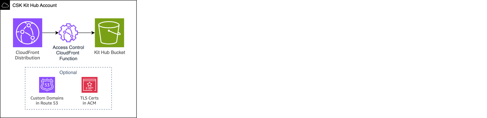

# The CSK Kit Hub
 

The CSK Kit Hub project creates the infrastructure you need to host your own Starter Kits for the CSK App. 

## CSK Kit Hub Architecture

The Kit Hub project deploys the following AWS services:

* [Amazon CloudFront](https://aws.amazon.com/cloudfront) (CDN and request auth/routing)
* [Amazon S3](https://aws.amazon.com/s3) (Object storage for web-accessible content)
* [AWS Lambda@Edge](https://aws.amazon.com/lambda/edge/) (Used by CloudFront to support directory index files in S3)
* [Amazon Route 53](https://aws.amazon.com/route53/) (DNS records, optional)
* [AWS Certificate Manager](https://aws.amazon.com/acm) (TLS cert to use with CloudFront, optional)

It deploys example content into the provisioned S3 bucket.

## Kit Hub security

By default, this project creates a publicly-accessible web site. You can choose to enable access control via a Kit Hub Passcode, which implements a shared-secret mechanism to restrict access to your Kits. You should evaluate this mechanism to determine if it meets your security requirements.

#### The Kit Hub Passcode mechanism

A secret is stored in the CSK Kit Hub AWS account, within the CloudFront KeyValueStore service. This secret is visible to people with access to your AWS account, however there is no mechanism to access it over the open Internet.

The same secret is stored in the CSK Admin portal. Again, this secret is visible to people with access to your AWS account, however there is no mechanism to access it over the open Internet unless you have a valid CSK App Key that is configured to use the Kit Hub Passcode. 

Essentially, this IP protection mechanism relies on 

1. The CSK App Key being a randomly-generated short UUID that bad actors would be unlikely to guess.
2. CSK App users acting in good faith by not sharing their CSK App key or attempting to sniff network traffic to find the Passcode associated with a Kit Hub.

We believe this provides a reasonable trade-off between protection of IP and usability. If your requirements for IP protection exceed what this mechanism offers you will need to implement your own solution.

Click <a href="deploying.en.md">next</a> to start deploying the CSK Kit Hub.