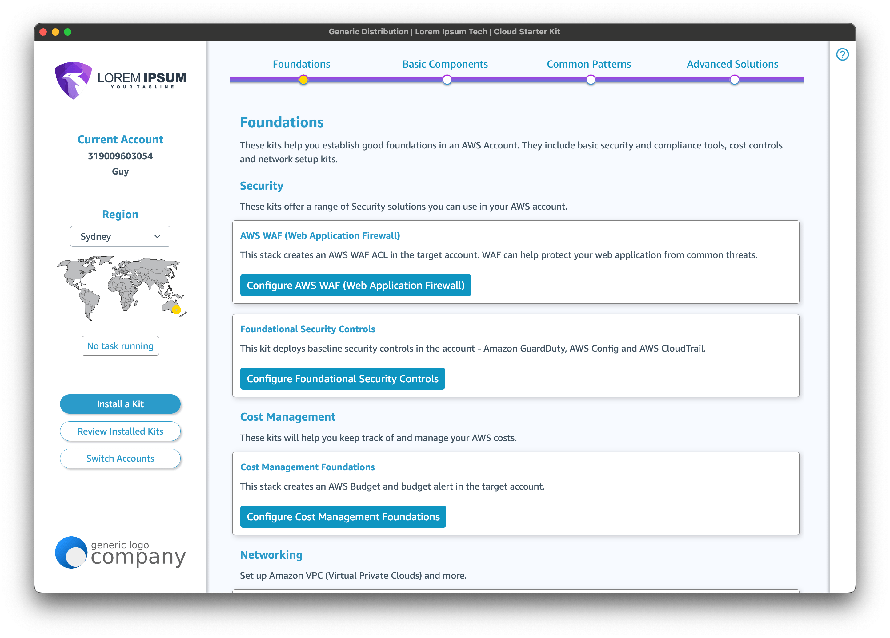

# The Cloud Starter Kit Workshop
 

## AWS Workshop Studio 
This workshop can be viewed on AWS Workshop Studio [https://catalog.workshops.aws/cloud-starter-kit/](https://catalog.workshops.aws/cloud-starter-kit/). The content presented here on Github is the same, in case for any reason you prefer to use it here.

## Contents
* <a href="introduction/index.en.md">CSK Solution Architecture</a>
* <a href="csk-kit-hub/index.en.md">The CSK Kit Hub</a>
  * <a href="csk-kit-hub/index.en.md">About</a>
  * <a href="csk-kit-hub/deploying.en.md">Deploying</a>
  * <a href="csk-kit-hub/access-control.en.md">Access Control</a>
  * <a href="csk-kit-hub/how-it-works.en.md">How it works</a>
    * <a href="csk-kit-hub/importing/index.en.md">Importing Kits</a>
    * <a href="csk-kit-hub/importing/importing-kits-cfn.en.md">CFN Kits</a>
    * <a href="csk-kit-hub/importing/importing-kits-cdk.en.md">CDK Kits</a>
* <a href="csk-app/index.en.md">The CSK App</a>
  * <a href="csk-app/building.en.md">Building the App</a>
  * <a href="csk-app/using.en.md">Using the App</a>
* <a href="csk-admin/index.en.md">The CSK Admin Portal</a>
  * <a href="csk-admin/deploying.en.md">Deploying</a>
  * <a href="csk-admin/using.en.md">Using the Admin Portal</a>
* <a href="clean-up/index.en.md">Clean Up</a>

## What is the Cloud Starter Kit?

The Cloud Starter Kit (CSK) is a way to lower the technical barrier to getting started on AWS. 

End-users of this solution use the Cloud Starter Kit App - a desktop app that makes it easy to find, configure and deploy best-practice solutions into AWS accounts. 

The CSK Admin Portal and Kit Hub allow ISVs, distributors and partners to define and manage their solutions (aka Kits) so they appear as deployable Kits in the Cloud Starter Kit App.

## What's in this Workshop?

This workshop takes you through building the three core components of the Cloud Starter Kit.

1. The CSK App - the desktop app that can be used by both MacOS and Windows users. It provides a single pane of glass for provisioning solutions in an AWS account by simplifying the deployment of [AWS CloudFormation](https://aws.amazon.com/cloudformation/) and [AWS CDK](https://aws.amazon.com/cdk/)-based applications. 

2. The CSK Kit Hub - a web-based repository where you can store the "Kits" that will be deployed through the CSK App. This provides you with the ability to customise the layout and content of the Kits that the app offers.

3. The CSK Admin portal - allows you to manage your own back-end services for the CSK app. The Admin portal is where the CSK app receives its configuration and reports back its activities. 

### Intended Audience

This workshop is aimed at AWS partners looking to use the CSK to help their customers deploy their solutions.

### Costs

The infrastructure created in this workshop is all Serverless and costs will vary by usage. If left idle, the monthly running costs will be in the order of 10USD.

The clean-up page outlines the procedures to remove the resources created by this workshop to minimise ongoing costs.

### Prerequisites

You should have a development environment with [Node.js v20](https://nodejs.org/en/download/package-manager) (we recommend using [nvm](https://github.com/nvm-sh/nvm) to manage Node installs), [Python 3]() (we recommend using [pyenv](https://github.com/pyenv/pyenv) to manage Python versions), the [AWS CDK](https://aws.amazon.com/cdk/) and [AWS CLI](https://aws.amazon.com/cli/) installed.

### LICENSE

This software is distributed under [the MIT-0 license](https://github.com/aws/mit-0).

>
>MIT No Attribution
>
>Copyright 2024 Amazon.com, Inc. or its affiliates. All Rights Reserved.
>
>Permission is hereby granted, free of charge, to any person obtaining a copy of this
>software and associated documentation files (the "Software"), to deal in the Software
>without restriction, including without limitation the rights to use, copy, modify,
>merge, publish, distribute, sublicense, and/or sell copies of the Software, and to
>permit persons to whom the Software is furnished to do so.
>
>THE SOFTWARE IS PROVIDED "AS IS", WITHOUT WARRANTY OF ANY KIND, EXPRESS OR IMPLIED,
>INCLUDING BUT NOT LIMITED TO THE WARRANTIES OF MERCHANTABILITY, FITNESS FOR A
>PARTICULAR PURPOSE AND NONINFRINGEMENT. IN NO EVENT SHALL THE AUTHORS OR COPYRIGHT
>HOLDERS BE LIABLE FOR ANY CLAIM, DAMAGES OR OTHER LIABILITY, WHETHER IN AN ACTION
>OF CONTRACT, TORT OR OTHERWISE, ARISING FROM, OUT OF OR IN CONNECTION WITH THE
>SOFTWARE OR THE USE OR OTHER DEALINGS IN THE SOFTWARE.
>

By using this software, you are agreeing to the terms of the MIT-0 licence, including the above warranty.

### Next Steps
If you've acknowledged the above and are ready to start building, click <a href="introduction/index.en.md">next</a> to get started.
